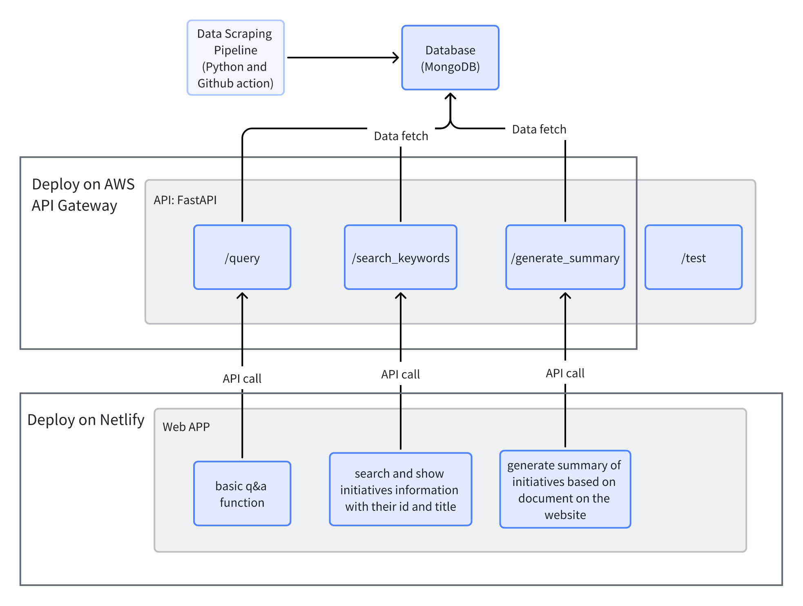
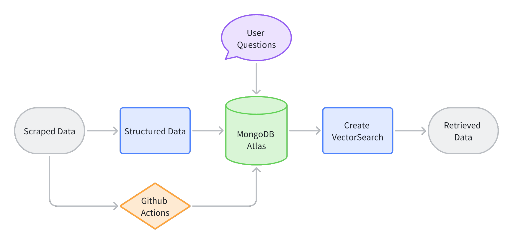

# Architecture

## design logic

The basic architecture design of the system:

## data scraping pipline

### Pipeline description:

Pipeline: .github/workflows/scraping-job.yml

Folder: src/scraping/ScrapingWithPDF/

Files: 

(1) functions: 

utilsScraping.py: Functions for scraping data from websites and storing it into MongoDB Atlas.

utilsPreprocessing.py: Functions for preprocessing metadata from MongoDB Atlas and restoring it.

(2) stages:

1_scrapingMetadata.py: Scraping metadata from websites and storing it into MongoDB Atlas.

2_preprocessingMetadata.py: Preprocessing metadata from MongoDB Atlas, download pdf, vector embedding, feture combination and restoring it.

3_dataVisualization.py: store data for keywords search and initiatives summarization.

## API design

Folder and files: src/nlp/chain/feedback_chain.py

## Frontend design

Folder: src/frontend/feedback-app

### Components

(1) ChatContainer: Chat container for displaying chat messages and sending messages.

(2) NaviContainer: Navigation container for displaying navigation bar.

(3) RatingContainer: Rating container for displaying rating stars.

(4) SidebarContainer: Sidebar container for displaying sidebar.

(5) SourceContainer: Source container for displaying source information.

(6) Title: Title container for displaying title.

### Hooks:

(1) useChat: It combines user input, speech recognition and message management for convenient use in the component.

(2) useChatMessages: Responsible for managing the state and logic related to chat messages and interactions with the backend, including sending user messages, receiving bot replies, handling errors, displaying loading status, etc.

(3) useDrawer: Handles the state and behavior of the drawer component, including opening and closing the drawer, and managing the drawer's content.

(4) useDynamicProperty: For shining title(no more use)

(5) useInput: Manage input control state and behavior.

(6) useKeywordSearch: Functions for processing keyword searches, displaying results and generating summaries.

(7) useVoiceRecognition: Manage voice recognition state and behavior.

### icons
icons

### screens/Home

Main screen of the app.

### styleguide.css

Control the global style of the app.

